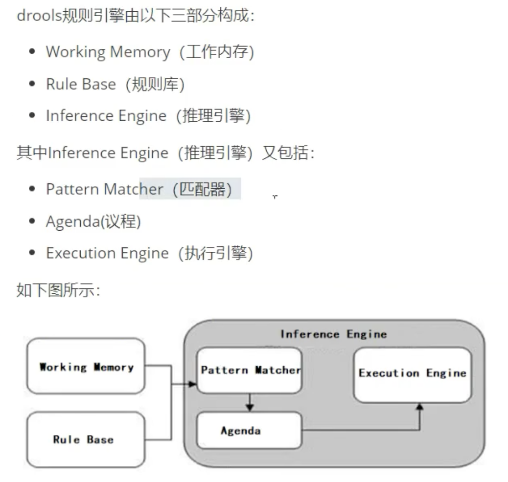
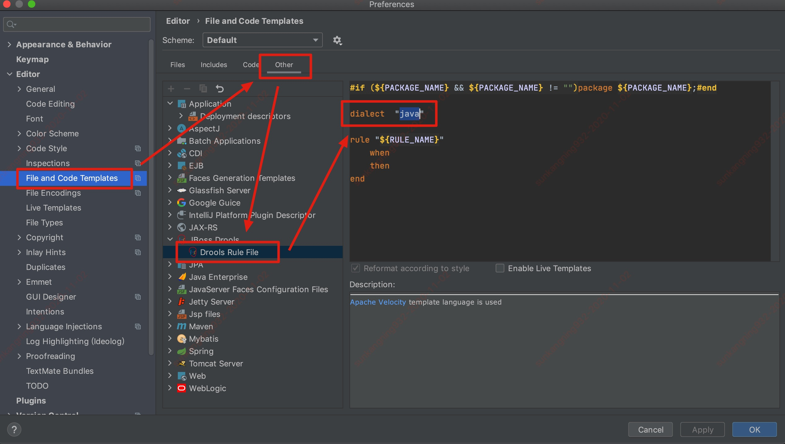
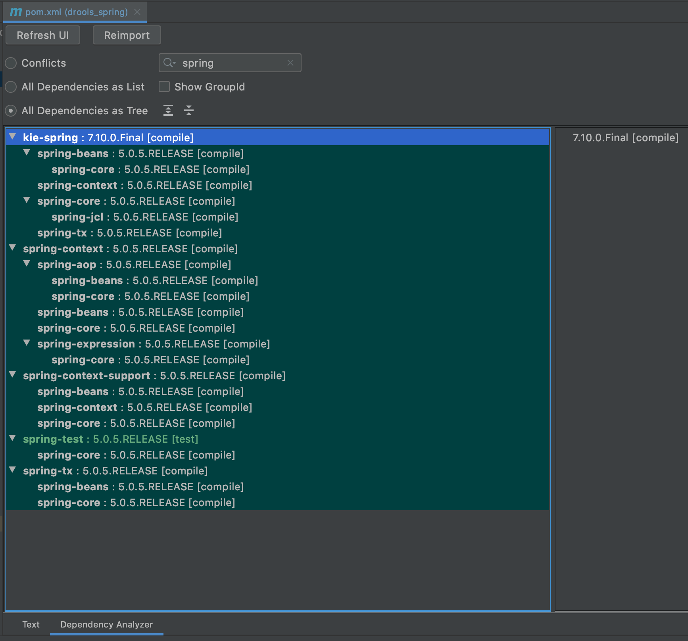

# drools_quickstart

> KIE (Knowledge Is Everything)

## 官网地址

https://www.drools.org/

## 视频教学地址

https://www.bilibili.com/video/BV1Pa4y1a7u6?p=12

## 文档地址

> forked from HappySnailSunshine/JavaInterview

https://github.com/corningsun/JavaInterview/blob/master/docs/Drools.md

## 规则引擎构成



## Drools 规则文件模版修改



## Idea 插件 maven-helper

可以直观看到依赖的 jar 包有没有冲突

插件地址： https://plugins.jetbrains.com/plugin/7179-maven-helper



## 决策表

> 规则是在太多，Excel 偷懒了，只搞了三个条件
> 路径：`/src/main/resources/rules/insuranceInfoCheck.xls`

* 生成的 drl 文件

```drools
package rules;
//generated from Decision Table
import com.corning.drools.entity.InsuranceInfo;
import java.util.List;
global java.util.List listRules;
// rule values at B11, header at B6
rule "insurance-rules_11"
	salience 65535
	agenda-group "sign"
	when
		$insuranceInfo:InsuranceInfo(param1 != "PICC")
	then
		listRules.add("保险公司不支持");
end

// rule values at B12, header at B6
rule "insurance-rules_12"
	salience 65534
	agenda-group "sign"
	when
		$insuranceInfo:InsuranceInfo(param4 != "北京",param4 != "天津")
	then
		listRules.add("销售区域不支持");
end

// rule values at B13, header at B6
rule "insurance-rules_13"
	salience 65533
	agenda-group "sign"
	when
		$insuranceInfo:InsuranceInfo(Integer.parseInt(param5)<0 ||  Integer.parseInt(param5)>17)
	then
		listRules.add("投保人年龄不支持");
end
```

## 最后总结

* 学完了，但其实才入门
* workbench 很鸡肋，真的让业务人员编辑规则还是 `决策表` 方式比较好
* 针对企业级，海量请求时，每次从文件获取规则文件方式肯定要调整，得加上缓存处理

> 就这样吧，完结，🎉

